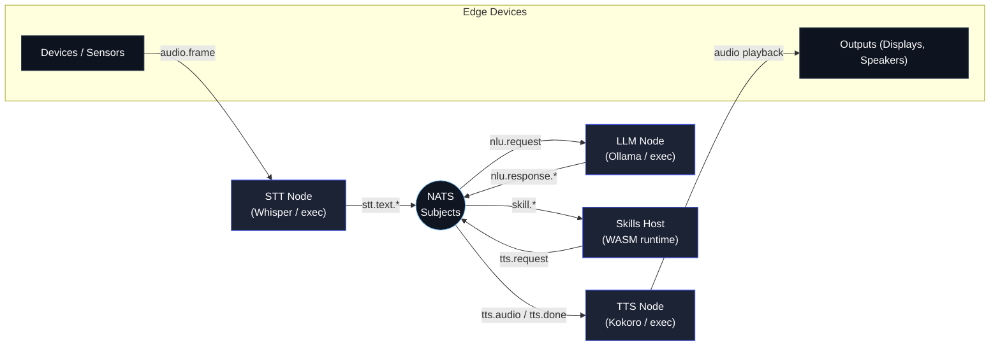

# Loqa Architecture Overview

Loqa is a modular, local-first ambient intelligence platform. The runtime stitches together speech interfaces, local language models, and extensible skills over a high-performance message bus. This document summarizes the core services, message subjects, and extension points that make up the MVP architecture.

## High-level layout

All communication between services flows through NATS subjects, allowing each capability to scale out on separate machines or be colocated on a single box for development.

## Core services

### Runtime (`loqad`)
- Hosts the control plane: configuration loader, capability registry, node heartbeats, and HTTP health endpoints.
- Manages the embedded SQLite event store (`event_store` block) for audit trails and skill invocation history.
- Boots sub-services (router, skills host, telemetry exporters) based on configuration.

### Skills host
- Discovers manifests under `skills.directory`, validates permissions, and loads WASM or native adapters.
- Subscribes to declared subjects and executes the skill module for each inbound message.
- Emits audit records (`skill.invoke.start`, `skill.publish`, etc.) into the event store for traceability.

### Voice router
- Orchestrates the STT ➝ LLM ➝ TTS loop per conversation session.
- Applies per-tier QoS settings (latency histograms exported via OpenTelemetry).
- Emits OpenTelemetry spans such as `voice.session` with events `stt.text.partial`, `llm.response.final`, and `tts.done`.

### Observability adapters
- Metrics: Prometheus exporter on `/metrics` (configurable via `telemetry.prometheus_bind`).
- Tracing: OTLP export (gRPC) to Tempo, Jaeger, etc.
- Logging: JSON structured output with component annotations.

## Message bus subjects

The `internal/protocol` package defines the canonical subjects and payloads:

| Subject | Purpose |
| --- | --- |
| `audio.frame` | Raw PCM frames captured from microphone devices. |
| `stt.text.partial` / `stt.text.final` | Intermediate and final transcripts from the STT worker. |
| `nlu.request` | Router → LLM request carrying prompt, tier, and conversation context. |
| `nlu.response.partial` / `nlu.response.final` | Streaming LLM responses for planning or dialogue. |
| `tts.request` | Synthesized utterances queued for the TTS service. |
| `tts.audio` | Base64-encoded PCM emitted by the TTS worker. |
| `tts.done` | Marker indicating the speech response finished. |
| `skill.*` | Namespaced subjects owned by skills (e.g., `skill.timer.start`, `skill.home.command`). |

Skills may also leverage JetStream (KV, streams) if `capabilities.bus.kv` is set in the manifest.

## Deployment model

- **Single-node dev:** All services run in-process via `loqad`, using the `mock` adapters for STT/LLM/TTS or shelling out to helper scripts.
- **Multi-node cluster:** Each capability (STT, LLM, TTS, skills) can run on dedicated hardware. As nodes start they register heartbeat documents with the capability registry, enabling load-aware routing.
- **Horizontal scaling:** Additional runtimes subscribe to the same NATS cluster. Skills execute wherever the host is available; STT and TTS nodes distribute work by subject pattern.

## Extension points

1. **Skills runtime:** Author custom WASM modules with the TinyGo SDK, declare permissions in `skill.yaml`, and publish on approved subjects.
2. **External services:** Replace `exec` adapters with long-running gRPC or HTTP services. Only the subject contract needs to be honored.
3. **Message subjects:** Introduce new NATS subjects to represent sensors, dashboards, or automations; register them via the capability registry for discovery.
4. **Control plane APIs (roadmap):** The HTTP admin surface will expose cluster state, skill inventory, and configuration (planned for post-MVP).

## Security & privacy considerations

- Data stays on the local network unless an operator configures remote endpoints (e.g., OTLP to Grafana Cloud).
- Skills run in a sandboxed WASM runtime with explicit permissions for publishing subjects and accessing host APIs.
- Access control to NATS should be enforced via credentials or mTLS in production deployments.

## Next steps

For implementation details, review:

- [`docs/INSTALLATION.md`](INSTALLATION.md) for dependency setup
- [`docs/GETTING_STARTED.md`](GETTING_STARTED.md) for the sample pipeline walkthrough
- [`skills/AUTHORING_GUIDE.md`](../skills/AUTHORING_GUIDE.md) to build and package new skills

Community discussions and RFCs live in the [`loqa-meta`](https://github.com/loqalabs/loqa-meta) repository.
